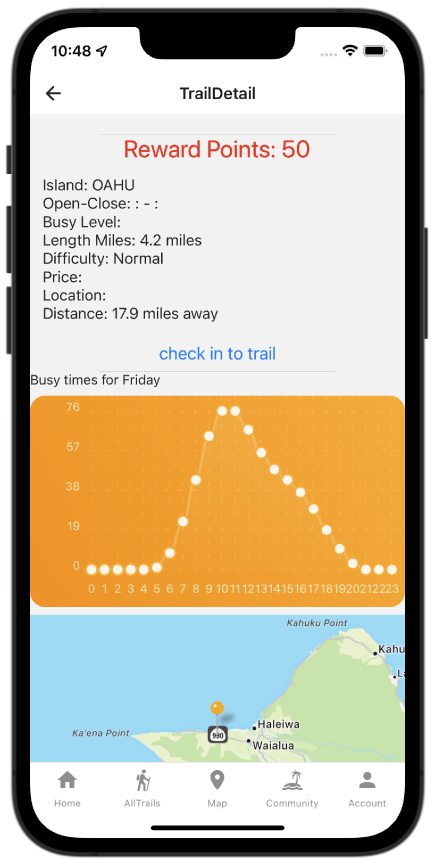

Code: https://github.com/HACC2021/Hanabata-Code

Devpost: https://devpost.com/software/hanabata-code?ref_content=my-projects-tab&ref_feature=my_projects

## Overview 

Hawaii Trails was my team's entry to the 2021 HACC Hackathon. Although we did not place, we were selected to present at the final round of judging. 

This project's goal was to create a full-stack application that would help reduce overcrowding on Hawaii's popular trails. We envisioned an app which would display Google Busy Times data on a map, and encourage users to select less-busy trails by displaying this information on a map. Finally, users would be rewarded for checking into trails, receiving more points for less-busy trails. 

The project has two key components: a Meteor app supporting an admin management UI, and a React Native iOS/Android app for end users. 

## Contributions to the project

I outlined the architecture of the system, set up the database by ingesting data from Google Busy Times, BestTime.app, and `portal.ehawaii.gov`, and configured the initial implementation of a Meteor REST endpoint. On the React Native app, I set up the map view with color-coded trail pins and implemented a check-in feature for users to receive points based on the trail's current level of traffic. 

I also assisted Yong with getting the token based login system working.

### Data ingestion 

The first step was getting a list of DLNR maintained trails. Luckily, the DLNR maintains such a list on their portal.ehawaii.gov page. Downloading a list of trails including their coordinates was as easy as inspecting the source of their page and getting JSON from the right URL. I then wrote a small script to deserialize each trail from JSON and insert it into the Meteor Mongo database. 

The next step was figuring out a source for busy times data at each trail. Google Maps seemed like an obvious choice, but their busy time data was not available through any public API. I discovered a competing platform called BestTime.app which seemed to provide the anonymized cell phone position data that we needed. I wrote a script to make a BestTime API call for each of the ingested DLNR trails. Although BestTime provided a search API that I could use based off of the location and name of each trail, it was not a convenient process. I could not directly access data for each trail; instead, I had to send a request for BestTime to create the data, then I had to repeatedly send subsequent queries to retrieve the data once the processing was done. 

I soon ran into an issue where the BestTime API started returning errors for most popular trails, claiming that no data was available. After struggling with their API, I eventually gave up and looked into a way to get traffic data out of Google. 

I found a Python packaged called [populartimes](https://github.com/m-wrzr/populartimes) which claimed to allow access to the Google data. After some configuration, I eventually was able to write two additional scripts: one to find a matching Google PlaceID for each of the saved trails, and another script to use the PlaceID to query Google for popular times data and update our database with the results. This worked, but only for around fifteen of the ~100 trails. We decided that as a proof of concept this would be good enough. 

The Google popular times data was in the form of an array: 

```
populartimes: [
  {
    day: 0,
    name: "Monday",
    data: [
      0: 0, //hour: busy_level (0-100)
      1: 0,
      2: 0,
      ...
    ]
  },
  ...
]

```

### Getting data from Meteor to React Native

After the database was finally seeded, the next step was to get data out of Mongo and into a React Native app. I found out that Meteor provides built-in support for creating RESTful endpoints through the `webapp` package ([documentation](https://docs.meteor.com/packages/webapp.html)). 

Once I verified that this was working, next step was to configure the React Native app to make an API request and pass the received data as a `prop` into a `map` component. I created an `ApiService` for the React to use to make requests using React's `fetch` API, which looked like this: 

```
function getTrails() {
  return fetch(`http://${baseUrl}/api/trails`, { method: "GET" })
    .then((res) => {
      return res.json();
    })
    .catch((error) => console.log(error));
}
```

### Displaying data on a map

After receiving trail data from the Meteor server, the next step was to get the data displaying on a map view. I found the [react-native-maps](https://docs.expo.dev/versions/latest/sdk/map-view/) package, and after some configuration, was able to get all of the trail data showing up on a map. 

Once I had this working, it was just a little bit of extra work to assign a color value for each map pin based on the current busy value for each trail according to the current time. The result looked like this: 


A grey pin indicates missing busy time data. 

I also set up an "All Trails" view to display a list of trails, and a "Trail Details" view, which both the map view and the all trails view would link to when a trail is selected:

<div style="display: flex;">




</div>

For the chart, I used the [react-native-chart-kit](https://www.npmjs.com/package/react-native-chart-kit) package. 

### Check in functionality and points assignment

Finally, the last major feature to implement was the ability for a user to check in to a trail and a number of points based on how busy the trail currently is. I had to implement some validation to prevent a user from checking in without actually going to a trail, or checking in multiple times. 

Here is the check in system that I envisioned: 


The actual implementation contained everything in the flow chart except for the anonymous endpoint check-in and cron processing, which we ran out of time to complete. The idea behind using an additional TrailCheckInCollection is that it would allow for easy data analytics in the future in order to create our own busy times data for each trail, instead of relying on any third party API. 

When the user checks in, the device uses the user's current location to ensure that they are within a half mile of the trailhead. Then the device sends the check-in request to the Meteor server, which checks if the user has already checked-in within the past 12 hours. If so, the server returns an error which is displayed to the user. Otherwise, the user is awarded points. 

Each check in is appended to an array of check-ins directly on the user object in the database, and also into a separate `TrailCheckInsCollection`. We hoped to eventually use the `TrailCheckInsCollection` to eventually create additional busy time data for trails without Google data, but we ran out of time before implementing this. 

We had also intended to create a system through which anyone could check in by scanning a QR code at a trailhead without an account, but we ran out of time there too. The implementation for this feature would be fairly trivial however -- just a basic Meteor page would allow for it to work. 

Finally, I created an Account view for the user to see their list of checkins and the total number of points: 


## What I learned

This was my first time working with React Native, the Google Places API, device location services, and Meteor as a backend server. React Native had a little bit of a learning curve, especially when I realized that we were using something called Expo instead of pure React Native. However, one thing I appreciated about React Native / Expo is that it did make testing very easy. Opening the app in the iOS simulator couldn't have been simpler. 