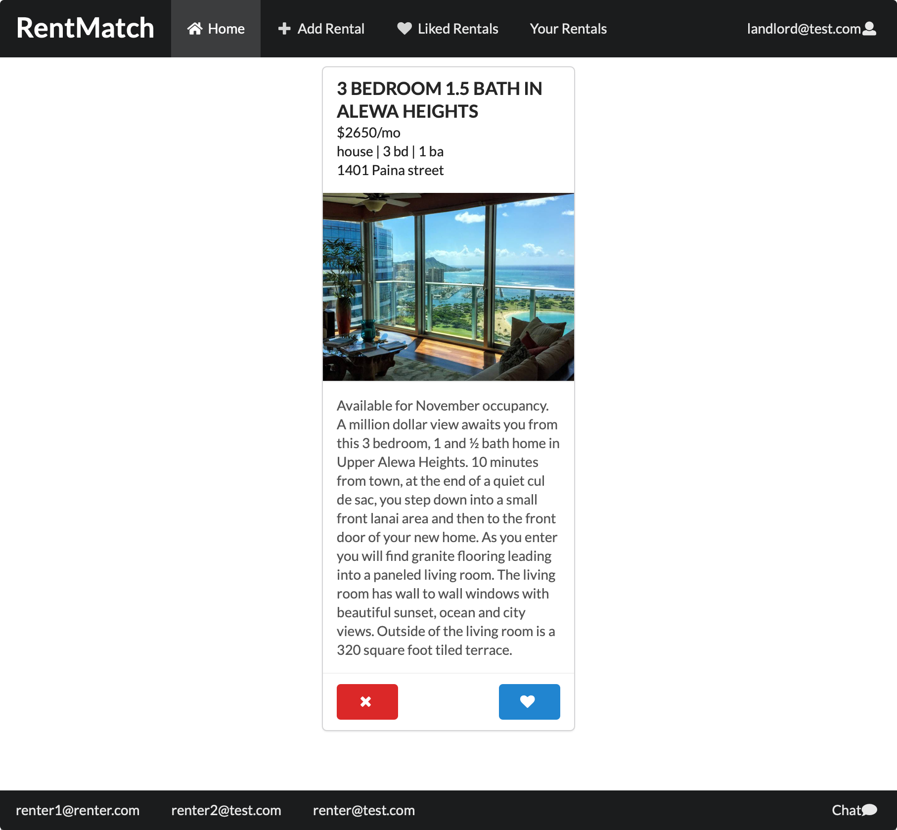

Code: https://github.com/491-Team-9/RentMatch

Live Project: http://491-team-9-housematch.meteorapp.com

## Overview 

RentMatch was created as an entry by a team of myself and three other students for the 2021 Meteor Impact Hackaton which took place over a five day period. The concept was an app to streamline the process of finding a place to live. Our main requirements were that it should:

1. Make discovering rentals fast and easy
2. Make keeping track of applications fast and easy 
3. Reduce the number of rental scams

This concept was born from my own frustration in finding a place to live in the SF Bay Area on Craigslist. While Craigslist does feature the largest number of available rentals in one place, it also has a confusing interface and requires the user to email a potential landlord in a standard email client. After emailing several landlords, it becomes very easy to lose track on which ones you've already tried to contact. And of the landlords who do reply (most of them don't), several of them are obvious scams.

## Implementation 

Our solution to make browsing easier was to adopt a card-swiping interface that's commonly found on dating apps such as Tinder or Hinge. Selecting the heart icon automatically alerts the landlord, while selecting the reject icon removes the card from the stack. 

The landlord can see a list of their rentals and a list of anyone who's applied. They can quickly view important stats about the applicant, such as the number of tenants and number of pets. They can also click on the applicant's card to view a biography saved to the user's profile. 

If a landlord accepts a renter's request, the landlord and renter become connected and are able to exchange messages using the chat interface. This is tracked with an array of `connections` on each user account. The "chat" button in the lower right corner displays a list of connected users to chat with. Clicking on a user creates a new conversation with them which is accessible from the bottom of the page (similar to Facebook).

Creating real-time chat functionality was surprisingly easy to do with Meteor's powerful data binding to the model stored in MongoDB. In the database, I stored a collection of `chat` objects which contained an array of `messages`. Sending a message and displaying it to the recipient user was as simple as appending a new message to the array. 

## Personal contribution

The project was my idea and design, and primarily my implementation as well, since I ended up making the majority of the commits to the main branch. In terms of design, my primary accomplishments were: 

- The Tinder-styled interface. An array of `rentals` is loaded from the database. Likes and dislikes are tracked with an array of `likes` and `dislikes` on each rental. 
- Allowing renters and landlords to connect. Each `user` contains an array of `connections`; when a landlord approves a renter's request, the renter's `user._id` is added to the landlord's `user.connections` array, and vice versa.  
- Real-time chat. As mentioned earlier, Meteor's powerful data binding made this straightforward and enjoyable to implement. 

## A learning experience

My biggest takeaway from this project was the importance of team planning. Although the team did have a kanban board setup in Github, it seems that my teammates were unclear about which tasks needed to be fulfilled. In the future, I'll try to take a more proactive role with planning and ensure that everyone knows which task they should work on. 